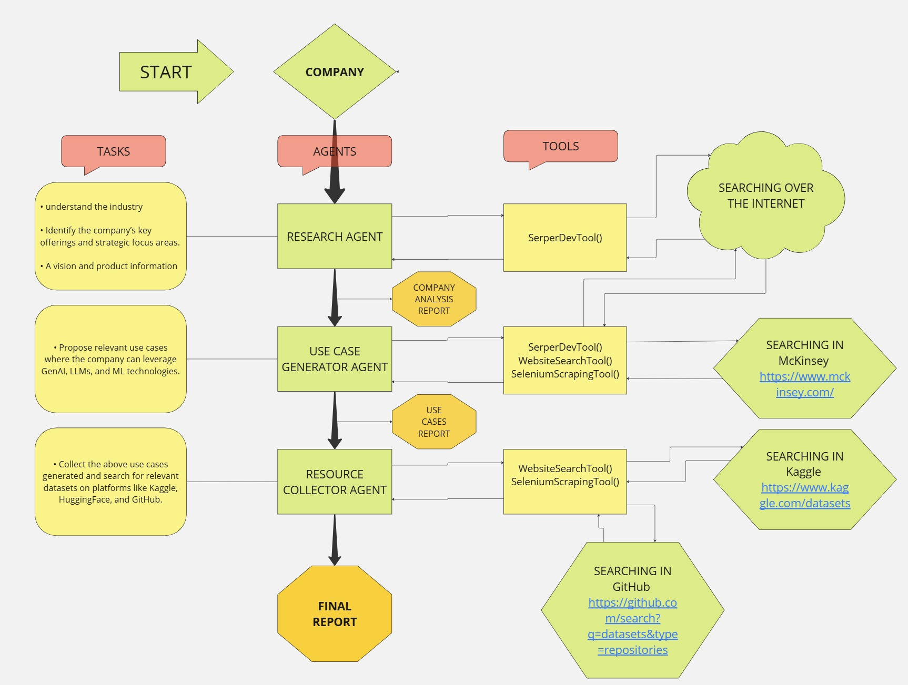

# Business_Transformer

## Market Research & Use case Generation

Our multi-agent AI system functions as a cutting-edge research assistant, seamlessly integrating the expertise of three specialized agents. When you provide a company name, the **Research Agent** conducts an in-depth exploration of the web to compile detailed insights about the company’s core business, strategic goals, and industry focus. This data is then handed off to the **Use Case Generator Agent**, which evaluates the information to uncover potential opportunities for leveraging AI technologies like GenAI, LLMs, and machine learning solutions tailored to the company’s unique needs. Finally, the **Resource Collector Agent** identifies essential datasets, pre-trained models, and implementation tools from platforms such as Kaggle, Hugging Face, and GitHub, ensuring each suggested AI use case is backed by actionable resources. The result is a comprehensive report that transforms AI possibilities into practical solutions ready for implementation.

<details open="open">
  <summary>Table of Contents</summary>
  <ol>
    <li>
      <a href="#Approach">Approach</a>
    </li>
    <li>
      <a href="#Technologies">Technologies</a>
    </li>
    <li>
      <a href="Project Workflow">Workflow</a>
    </li>
    <li>
	    <a href = "#How-to-Start-Project">How to Start Project</a>
    </li>
    <li>
	    <a href = "#Contact-Us">Contact Us</a>
    </li>
  </ol>
</details>

## Approach
Our approach leverages Crew AI's multi-agent architecture to create an intelligent system that breaks down complex AI implementation analysis into manageable, specialized tasks. Each agent in our system acts as an expert in its domain - from company research to use case generation and resource collection. Through this orchestrated workflow, the agents work in harmony: gathering comprehensive company information, analyzing AI implementation possibilities focusing on GenAI and LLMs, and matching these opportunities with practical resources from leading platforms. This systematic division of responsibilities ensures both efficiency and thoroughness in delivering actionable AI implementation strategies.

## Technologies
- Python
- Streamlit
- CrewAI
- Langchain

## Project Workflow:

<div style="display:flex; flex-wrap:wrap; gap:2%; justify-content:center;">

</div>

## How to Start Project

Follow these steps to get started with the project:

1. **Clone the Repository:**
   ```bash
   git clone <repository_link>
  
   ``` 
2. **Navigate to the project directory:**
   ```bash

      cd <extracted-directory>
      
   ``` 
   
3. **Create  Virtual Environment:**
   
   Create a new virtual environment using Python 3.10 or greater versions:

   ```bash
   python -m venv <Your your_env_name
   ```
   Replace your_env_name with the desired name for your virtual environment.
   
   Activate the newly created environment:
   ```bash
    your_env_name/bin/activate 
   ```
4. **Install Dependencies:**
   
   Install the project dependencies by running:
   ```bash
   pip install -r requirements.txt
   ```
   lock the dependencies and then install them:
   ```bash
   poetry lock
   ```
   ```bash
   poetry install
   ```
   This command will install all the required packages listed in the requirements.txt file.

5. **\.env file**
    create .env file and put all required API Keys inside it.

6. **Run the Streamlit App:**
   ```bash
   streamlit run Business_Transformer.py
   ```
   This command will start the Streamlit app.

## Contact Us

To learn more about, please reach out:

📧 princeavasani@gmail.com